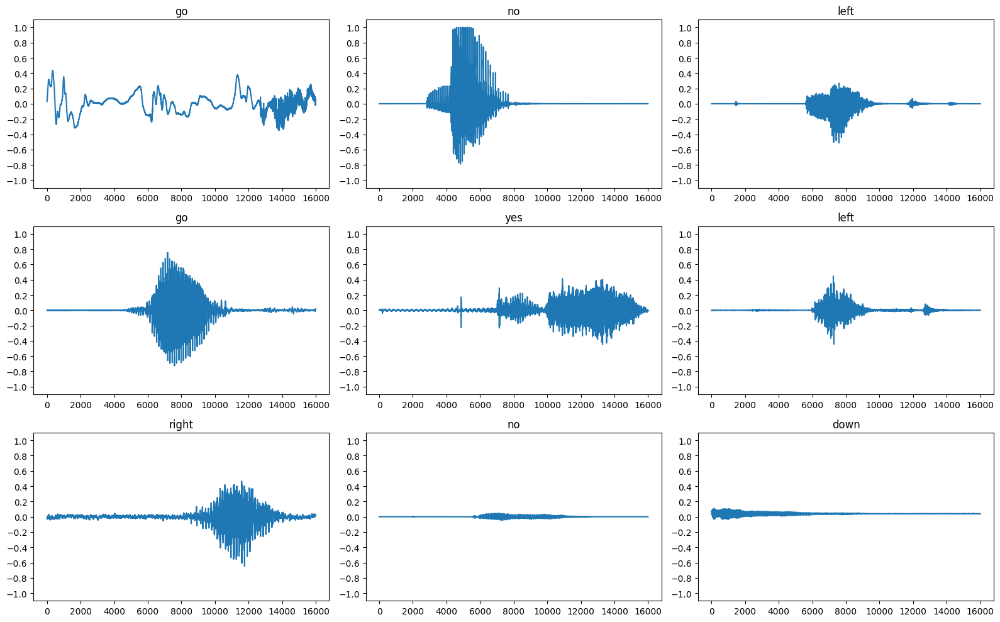
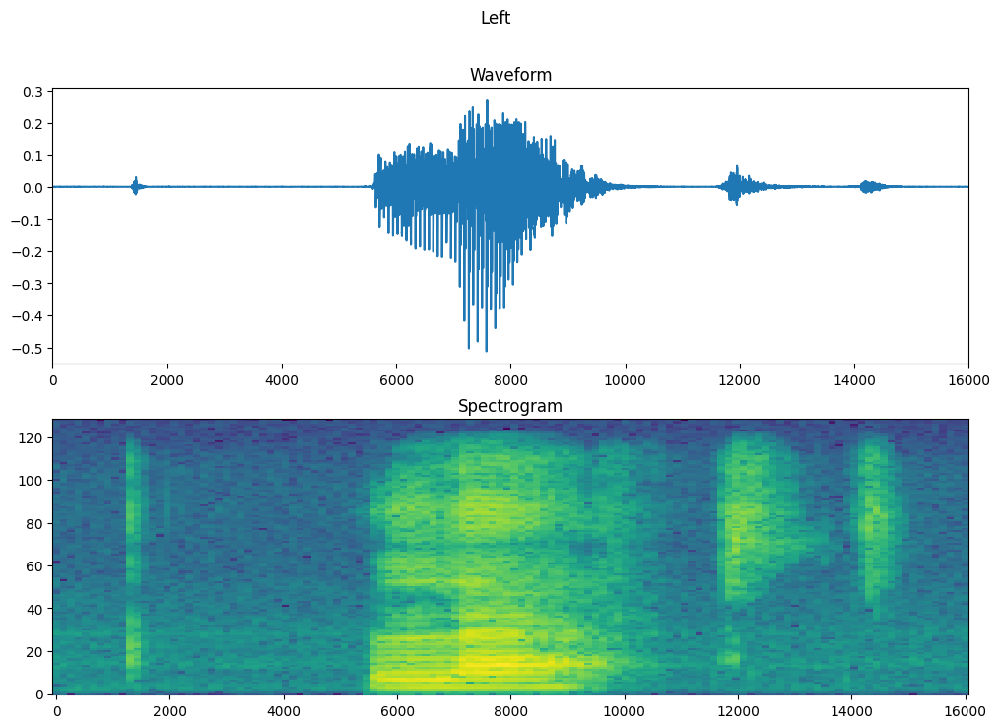
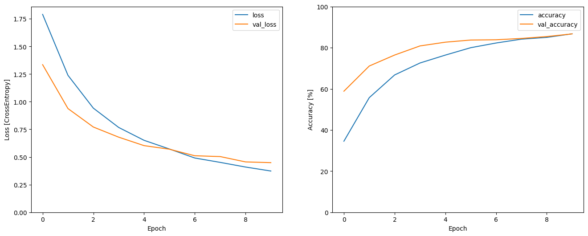
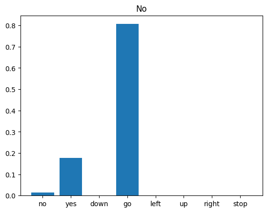

# Speech Command Recognition with TensorFlow

This repository contains code for a speech command recognition project using TensorFlow. The project focuses on building a machine learning model to classify spoken commands into different categories. The code provided here is based on a notebook and includes steps for dataset preparation, model building, training, evaluation, and prediction.

Recognizing audio clips of commands, such as "down", "go", "left", "no", "right", "stop", "up" and "yes".

</br>  <a href="https://www.buymeacoffee.com/wamiqraza">BUY ME A COFFEE</a> 

## Prerequisites

To run this code, you will need the following:

- Python 3.x
- TensorFlow
- Matplotlib
- Numpy
- Seaborn

You can install the required packages using the following command:

```
pip install tensorflow matplotlib numpy seaborn

```

Clone this repository to your local machine:

```
git clone https://github.com/razacode/audio_recognizing_keywords.git
cd audio_recognizing_keywords

```

The notebook covers the following steps:

Importing necessary libraries and setting up the environment.
Mounting Google Drive to access the required dataset.
Importing and preprocessing the dataset.
Visualizing audio waveforms and spectrograms.
Building and training a convolutional neural network (CNN) model.
Evaluating the model's performance.
Saving the trained model for future use.
Performing predictions on new audio samples.

## Visulaize a plot for a few audio waveforms


## Transform the waveforms from the time-domain signals into the time-frequency-domain


## Plot accuracy and losses curve


## Model prediction

